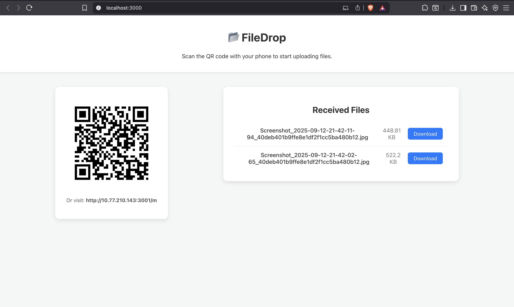

<div align="center">

# 📂 FileDrop  
### Self-Hosted, Cross-Platform File Sharing over Local Wi-Fi  

</div>

<p align="center">
  
  
  
  
  
  
</p>

---

## 📌 Overview  

**FileDrop** is a private, cross-platform file sharing tool that lets you transfer files from your phone to your computer over your local Wi-Fi using a QR code.  
Think of it as a **self-hosted AirDrop** that works on **any device**.  

---

## 🚀 How It Works  

1. Start the **Node.js server** on your laptop.  
2. Open the **dashboard** in your browser — it shows a QR code for your local IP.  
3. Scan the QR code with your **phone’s camera**.  
4. A simple **upload page** opens in your phone’s browser (no app required).  
5. Select files → they are sent directly to your laptop.  
6. Files appear on the dashboard **instantly** via WebSockets.  
7. Download with one click → saved to your **Downloads folder**.  

---

## ✨ Features  

- 🔐 **Privacy-First** → All transfers stay **inside your local network**.  
- 🧹 **Temporary Storage** → Files auto-delete after download.  
- ⚡ **Real-Time Updates** → Instant uploads with **Socket.IO**.  
- 🌍 **Cross-Platform** → Works with **Windows, macOS, Linux, iOS, Android**.  
- 📷 **No App Needed** → Just scan & upload from your phone browser.  

---

## 🛠️ Tech Stack  

| Layer            | Tech Used |
|------------------|-----------|
| **Backend**      | Node.js, Express |
| **File Uploads** | Multer |
| **Realtime**     | Socket.IO |
| **Dashboard**    | React |
| **Upload Page**  | HTML + Vanilla JS |
| **QR Codes**     | qrcode (server), qrcode.react (client) |

---

## 📂 Folder Structure  

```
FileDrop/
│── server/              # Node.js + Express backend
│   ├── routes/          # API routes
│   ├── uploads/         # Temporary file storage
│   ├── sockets/         # Socket.IO logic
│   └── index.js         # Server entry point
│
│── client-dashboard/    # React frontend (laptop dashboard)
│   └── src/
│
│── client-upload/       # Phone upload page (static HTML + JS)
│   └── index.html
│
└── README.md
```  

---

## ⚡ Quick Start  

### 1️⃣ Clone the repo  
```bash
git clone https://github.com/kartik0905/filedrop.git
cd filedrop
```

### 2️⃣ Install dependencies  
```bash
cd server && npm install
cd ../client-dashboard && npm install
```

### 3️⃣ Run the backend  
```bash
cd server
npm start
```

### 4️⃣ Run the dashboard  
```bash
cd client-dashboard
npm start
```

### 5️⃣ Access  
- Open `http://localhost:3000` on your laptop.  
- Scan the QR code with your phone to open the upload page.  

---

## 📸 Demo  

 

---

## 🧹 Cleanup  

- Files auto-delete after download.  
- Clear `uploads/` manually if needed.  

---

## 🔮 Future Enhancements  

- 🔑 Password-protected uploads  
- 📦 Batch downloads (zip multiple files)  
- 📲 Drag & Drop dashboard uploads  
- 🌐 LAN-wide discovery (no QR needed)  

---

## 🤝 Contributing  

Pull requests are welcome! Open an issue to discuss new features or fixes.  

---

## 📜 License  

MIT License © 2025 [Kartik Garg](https://github.com/kartik0905)  

